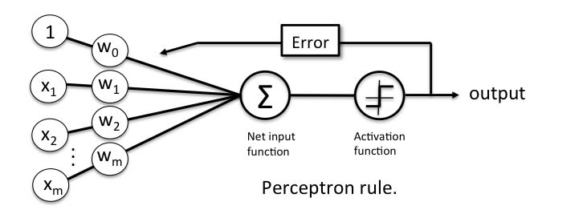

# Basic Perceptron Network
**Learning how to create a very basic perceptron network for machine learning**

As an UG student I was never really given much opportunity to explore machine learning in much capacity, but always 
found it interesting. I have made it my new years resolution to pick up as much as I can in my own time before starting 
an MSc next year, so here we are at my humble beginning.

This is simply the start of picking up the basics of neural networks, starting with a *perception network*

### What is a perceptron network?

A perceptron network is a single layered supervised learning algorithm. The algorithm is given inputs (*x*) and these inputs are  
multiplied by a weight (*w*). The sum of all the inputs multiplied by their weights is passed to the *perceptron
function*, which will calculate whether or not the neuron will activate (resulting in a boolean output).

A set of *training data* is given to the perceptron network, and starting weights are decided (in this case, randomly). 
The network will then compare its output with the expected output, and adjust the weights depending on how wrong the
output was. This process repeats until a satisfactory solution has been found.

This kind of learning is used for *linear binary classification*. The network should, in theory, be able to learn
whether or not an input belongs to a specific class or not.

For this basic network, the set of inputs are binary (1 or 0), and out the output is also binary. The activation
function (in this case) is the *sigmoid function*, which is to say:

*output = sigma(y) = 1/(1+e^(-y))* where 

* *y = sum(x \* w)*

The sigma function has asymptotes at 0 and 1, so we could set a threshold (or use a step function instead).

The adjustment for each weight (*w_i*) is calculated by:

*error * x_i * sigma'(output)* where 

* *error = output - expected output*
* *x_i is an input*
* *sigma'(output)* is the derivative of the sigma function at the output (in other words, the gradient at the calculated
output). This is because the gradient is lower the closer we get to 1 or 0, and the highest at 0.5. A way of thinking
about the sigma function is how "certain" the algorithm is. The closer it is to 1 or 0, the more certain it is, so the
weight needs changing less.

The training process itself is fairly simple:

1. Put the training data through the network to get the neuron output.
2. Calculate the error, which is the difference between the received output and the expected output.
3. Depending on the size of the error, adjust the weights for each input.

Repeat this process until satisfied with the result.
